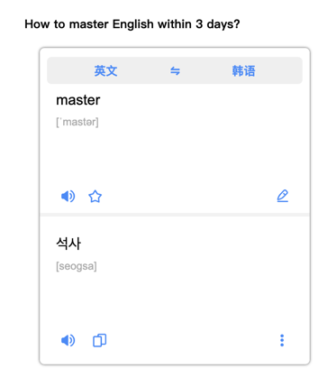
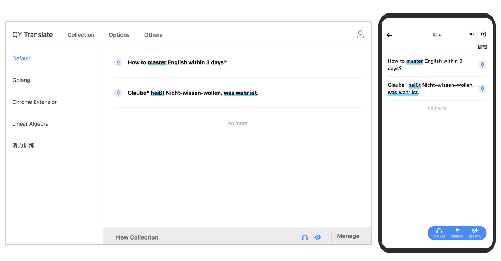

## QY Translate Instructions

[English](https://github.com/Kobshobe/qy_translate/blob/main/docs/Instructions/Instructions(English).md) | [简体中文](https://github.com/Kobshobe/qy_translate/blob/main/docs/Instructions/%E4%BD%BF%E7%94%A8%E8%AF%B4%E6%98%8E(%E7%AE%80%E4%BD%93%E4%B8%AD%E6%96%87).md) | [繁體中文](https://github.com/Kobshobe/qy_translate/blob/main/docs/Instructions/%E4%BD%BF%E7%94%A8%E8%AF%B4%E6%98%8E(%E7%B9%81%E4%BD%93%E4%B8%AD%E6%96%87).md)

tips: After installation, the opened page needs to be refreshed before it can be used normally!

### Select text to translate

* Method 1: select text to be translated with the mouse, right-click the mouse to pop up the menu, and click the Menu button with icon, then you can view the translation results.

* Method 2: select text to be translated with the mouse, and click the pop-up button near the mouse cursor, then you can view the translation results。

tips: Switches can be configured for the above functions

### Word Query

Click the iconin the upper right corner of the browser or use the shortcut key，to input the content you want to query in the input box of the pop-up page, then click the right arrow button or press `Shift + enter` to view the translation results。

tips: The default shortcut key is' Alt + K ', the MAC system is' command + K', and the 'Shift + Enter' key can be set as the 'Enter'.

### Two Translation Interaction Modes

#### Intelligent Simplicity Mode

* Intelligently detect the content's language then get the translation results. It is determined according to the main language and the second language you set. When the detected language is not the language you set, the language will be displayed intelligently, such as in the lower right corner of the middle figure.

* After translating a sentence, if you want to translate the words, you can select the post-translation again, and there will be more detailed translation results, as shown in the third figure。

tips: It is suggested to translate a long sentence with rich context, and the result will be more accurate。

#### Professional Mode

The professional mode can manually set the source language and target language of translation, and there are more features waiting for you to explore

### Common Translation Engine And Professional Translation Engine

The common translation engine provided recently include Baidu translation and Google translation, as well as translation engine in professional fields such as finance and economics, biomedicine and online literature. They are suitable for scenes of relevant majors to obtain more accurate and professional translation results

### PDF Reader For Translate

Built-in PDF reader can better support the translation of PDF files

Upper right corner of the browser, right-click the PDF reader icon to open it

If the current page is browsing a `.pdf` file, the system will automatically type the corresponding PDF file without re-importing. If it is a local file, please give the permission.

### Collection Management And Language Learning

Provide desktop and WeChat mini-app collection management.

After collecting a long sentence, you can make key marks for the words in the sentence.

tips: Long sentences have richer scenes and can better use the listening training provided by the app.

### Other Options

Right-click the icon in the upper right corner of the browser to open the menu, and click options to enter

### Five Star Praise To Support us

Give 5-star praise in the store to let more people find this app!

[chrome store](https://chrome.google.com/webstore/detail/fjldhjdclpmehigldnbgbllchcjdgccc) | [edge store](https://microsoftedge.microsoft.com/addons/detail/%E8%BD%BB%E6%B0%A7%E7%BF%BB%E8%AF%91/gldjnohpkhoipopkgkoepimoaoekhioo) 

Thank you for your support!