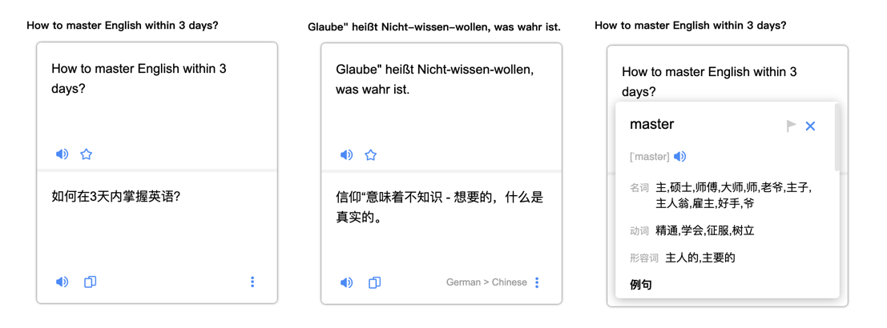
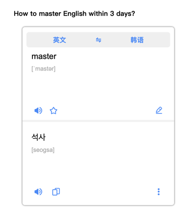
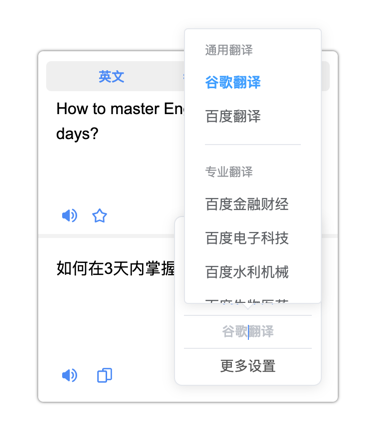
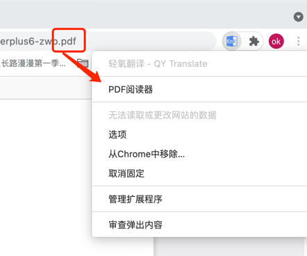

## 轻氧翻译使用说明

tips: 安装后已打开的页面需要刷新后方可正常使用哦！

### 划词翻译

* 方法一：鼠标选中需要翻译的单词或句子，鼠标右键弹出菜单，点击带图标的 `翻译` 即可查看翻译结果。

* 方法二：鼠标选中需要翻译的单词或句子，点击在鼠标光标附近弹出的图标即可翻译。

上述功能均可配置开关

### 输入查询

点击浏览器右上角的标志或者使用快捷键，在弹出页面的输入框中输入你想查询的内容，然后点击右箭头按钮或按`Shift+Enter`键即可查看翻译结果。

默认快捷键为`Alt+K`，Mac系统为`Command+K`, `Shift+Enter`键入翻译可设为`Enter`键

### 两种翻译交互模式

#### 智能简约

* 智能识别语种并翻译，根据您设置的主要语言和第二语言来判定，当识别出来的语种不是你设置的语种时会智能显示语种，如中间的图的右下角。

* 翻译一个句子后，想翻译其中的单词，可再次选取后翻译，会有更详细的翻译结果哦，如第三图。

tips: 建议翻译一个长句，有丰富的上下文结果会更准确。

#### 专业模式

专业模式可以手动设置翻译的源语言和目标语言，还有更多的特性等待大家探索

### 通用翻译与专业领域翻译

日前提供的通用翻译源有百度翻译和谷歌翻译，并有金融财经，生物医药，网络文学等专业领域的翻译源，适合相关专业的场景使用，获得更精准专业的翻译结果

### PDF阅读翻译˘

内置PDF阅读器，可以更好地支持对PDF文件的翻译

浏览器右上角图标右键打开菜单，点击PDF阅读器便可打开

如果当前页面浏览的是一个 `.pdf`文件，系统会自动打对应的PDF文件而无需重新导入，如果是本地文件要给权限哦

### 其他设置

浏览器右上角图标右键打开菜单，点击选项进入