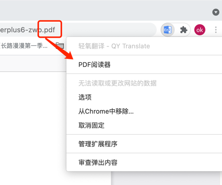

## 輕氧翻譯使用說明

[简体中文](https://github.com/Kobshobe/qy_translate/blob/main/docs/Instructions/%E4%BD%BF%E7%94%A8%E8%AF%B4%E6%98%8E(%E7%AE%80%E4%BD%93%E4%B8%AD%E6%96%87).md) | [繁體中文](https://github.com/Kobshobe/qy_translate/blob/main/docs/Instructions/%E4%BD%BF%E7%94%A8%E8%AF%B4%E6%98%8E(%E7%B9%81%E4%BD%93%E4%B8%AD%E6%96%87)%20.md)

tips: 安裝後已打開的頁面需要刷新後方可正常使用哦！

### 劃詞翻譯

* 方法一：鼠標選中需要翻譯的單詞或句子，鼠標右鍵彈出菜單，點擊帶圖標的 `翻譯` 即可查看翻譯結果。

* 方法二：鼠標選中需要翻譯的單詞或句子，點擊在鼠標光標附近彈出的圖標即可翻譯。

上述功能均可配置開關

### 輸入查詢

點擊瀏覽器右上角的標誌或者使用快捷鍵，在彈出頁面的輸入框中輸入你想查詢的內容，然後點擊右箭頭按鈕或按`Shift+ Enter`鍵即可查看翻譯結果。

默認快捷鍵為`Alt+K`，Mac系統為`Command+K`, `Shift+Enter`鍵入翻譯可設為`Enter`鍵

### 兩種翻譯交互模式

#### 智能簡約

* 智能識別語種並翻譯，根據您設置的主要語言和第二語言來判定，當識別出來的語種不是你設置的語種時會智能顯示語種，如中間的圖的右下角。
* 翻譯一個句子後，想翻譯其中的單詞，可再次選取後翻譯，會有更詳細的翻譯結果哦，如第三圖。

tips: 建議翻譯一個長句，有豐富的上下文結果會更準確。

#### 專業模式

專業模式可以手動設置翻譯的源語言和目標語言，還有更多的特性等待大家探索

### 通用翻譯與專業領域翻譯

目前提供的通用翻譯源有百度翻譯和谷歌翻譯，並有金融財經，生物醫藥，網絡文學等專業領域的翻譯源，適合相關專業的場景使用，獲得更精準專業的翻譯結果

### PDF閱讀翻譯

內置PDF閱讀器，可以更好地支持對PDF文件的翻譯

瀏覽器右上角圖標右鍵打開菜單，點擊PDF閱讀器便可打開如果當前頁面瀏覽的是一個 `.pdf`文件，系統會自動打對應的PDF文件而無需重新導入，如果是本地文件要給權限哦

### 收藏管理與語言學習

提供微信小程序作為移動端收藏管理，未來支持桌面端。

收藏一個長句後，可對句子中的單詞做重點標記。

長句有更豐富的場景，能更好地使用小程序提供的聽力訓練哦。

### 其他設置

瀏覽器右上角圖標右鍵打開菜單，點擊選項進入

### 五星好評

在商店給出5星好評，讓更多的人發現本應用！

[chrome store](https://chrome.google.com/webstore/detail/fjldhjdclpmehigldnbgbllchcjdgccc) | [edge store](https://microsoftedge.microsoft.com/addons/detail/%E8%BD%BB%E6%B0%A7%E7%BF%BB%E8%AF%91/gldjnohpkhoipopkgkoepimoaoekhioo) 

感謝大家的支持！

